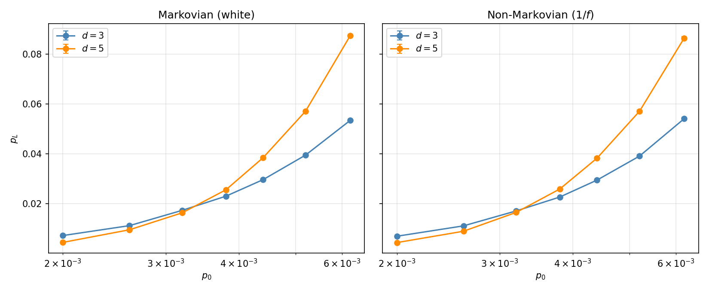
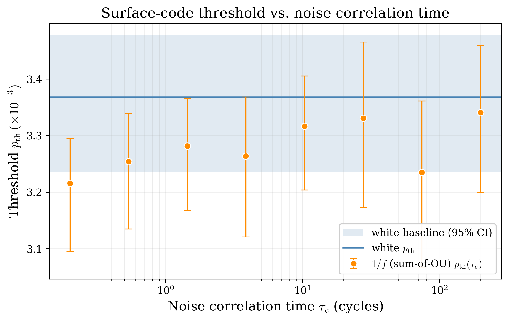

# Results: surface-code threshold under matched-marginal non-Markovian dephasing

**Summary.** This note reports the v1 headline result of `nonmarkov_qec`: a measurement of the rotated surface-code memory threshold under 1/f-type (sum-of-Ornstein–Uhlenbeck) dephasing, compared 
against a *statistically matched* Markovian (white) baseline, as a function of the noise correlation time `τ_c`. Holding the marginal per-cycle error process identical across the two arms and 
varying only its temporal autocorrelation, we find the threshold is **invariant** — the 1/f and white thresholds coincide within bootstrap confidence intervals across three decades of correlation 
time (`τ_c = 0.2 → 200` gate cycles). This is an *independent reproduction*, built from our own design notes before consulting the literature, of the regime that Kam et al. (2025) identify as 
non-detrimental; their detrimental structures lie outside our v1 noise placement and define the Phase 2 roadmap.

---

## 1. The controlled comparison

The experiment isolates a single variable: the *temporal memory* of the noise. Per data qubit `q` and cycle `k`, the injection layer sets a dephasing (`Z_ERROR`) probability

```
p_q(k) = clip(p_0 + alpha * X_q(k), 0, 1),    alpha = m * p_0 / sigma_X
```

where `X_q(k)` is a zero-mean stochastic trajectory with stationary standard deviation `sigma_X`, and `m` (= 0.5 here) is a dimensionless modulation depth. Because `alpha * X` has standard deviation 
`alpha * sigma_X = m * p_0` *independent of `sigma_X`*, the marginal distribution of `p_q(k)` is `N(p_0, (m*p_0)^2)` regardless of which process generated `X`. Consequently:

- **Mean matched:** `E[p] = p_0` in both arms (X is zero-mean).
- **Marginal variance matched:** `Var(p) = (m*p_0)^2` in both arms, by construction.
- **Sole difference:** the autocorrelation of `X(k)` — delta-correlated (white) in the Markovian arm, exponentially decaying with correlation time `τ_c` in the non-Markovian arm.

A useful consequence: since `alpha = m*p_0/sigma` and `X ~ N(0, sigma^2)`, the injected fluctuation `alpha*X ~ N(0, (m*p_0)^2)` is *independent of the absolute value of `sigma`*. The stationary 
standard deviation cancels exactly; it is a pure normalization. We therefore fix `sigma = 1` and feed the identical value to both process constructors and the injection map, which guarantees the 
matched-marginal property analytically (not merely to sampling tolerance).

What is held identical is the *instantaneous per-cycle error power*, not the accumulated dephasing over a cycle: correlated noise accumulates phase differently, and that difference is precisely the 
effect under test. Physically the comparison is **temporally-independent errors vs. bursty errors** (runs of high-`p` cycles clustered in time) at identical instantaneous noise power.

## 2. Noise model

The non-Markovian arm uses an Ornstein–Uhlenbeck (OU) process, the simplest colored noise with a closed-form solution and an exact white-noise limit:

```
dX = -(X / tau_c) dt + sqrt(2 sigma^2 / tau_c) dW,
C(tau) = sigma^2 exp(-|tau|/tau_c),   X ~ N(0, sigma^2).
```

The sampler uses the exact-update recursion `X_{k+1} = a X_k + b xi_k` with `a = exp(-dt/tau_c)`, `b = sigma sqrt(1 - a^2)` (validated against the analytic stationary distribution, autocorrelation, 
discrete-time AR(1) spectrum, and the `tau_c -> 0` Markovian limit). A single OU process has a Lorentzian spectrum (flat, then `f^-2`); to synthesize 1/f noise we sum `N` independent OU components 
with log-spaced correlation times and equal per-component variance `sigma_j = sigma_total/sqrt(N)`, so `Var(sum) = sigma_total^2` and the summed spectrum tiles a `1/f` band (measured slope `-0.998` 
over the band).

Two distinct realizations are used:

- **1/f band demonstration (Section 5).** `SumOfOUProcess.from_frequency_band` over a band corresponding to `τ ∈ [0.5, 20]` cycles — a genuine 1/f spectrum — for the per-band threshold crossing.
- **Correlation-time sweep (Section 6).** A *single* OU process per point, giving each `τ_c` an unambiguous correlation time (one Lorentzian), swept `τ_c = 0.2 → 200` cycles.

The white baseline (`WhiteNoiseProcess`) draws i.i.d. `N(0, sigma_total^2)` with no temporal memory, through the identical injection path.

## 3. Code, decoder, and the two-layer Monte Carlo

**Code.** Rotated surface code, X-basis memory, parameterized for odd distance `d` with `rounds = d` (square spacetime patch), `2d^2 - 1` physical qubits. The construction is validated by the 
distance gate `shortest_graphlike_error == d` at both `d = 3` and `d = 5`.

**Decoder.** Minimum-weight perfect matching (PyMatching) compiled from the circuit's detector error model (`decompose_errors=True`, single logical observable). The decoder is built **once per `(d, 
p_0)` point** on a constant-`p_0` circuit and reused across all trajectories — it is deliberately *correlation-blind*. This is the physically honest choice: a real decoder is calibrated to the 
average noise model and cannot adapt to an instantaneous correlated burst; rebuilding it per trajectory would let it absorb the very excursion the experiment measures.

**Two-layer Monte Carlo.** The reported quantity is the logical error rate under the noise *process*, `p_L = E_X[p_L(X)]`, requiring two nested averages:

- *Layer 1 (shots):* one trajectory freezes the per-gate probabilities into one noisy circuit; `shots` samples estimate the conditional rate `p_L(X)`.
- *Layer 2 (trajectories):* `N_traj` independent trajectories are averaged. Estimator `rate = mean_i(r_i)`, `stderr = std_i(r_i)/sqrt(N_traj)`, which folds both layers.

Both layers are mandatory. A single white trajectory nearly self-averages (its `d^2 * rounds` per-gate probabilities are i.i.d.), but a 1/f trajectory does not — temporal correlation lets an entire 
trajectory sit in a high-`p` excursion, so the between-trajectory variance is substantial in the OU arm. A one-trajectory design would understate uncertainty precisely in the arm carrying the 
headline. Production budgets: `shots = 4000`, `N_traj = 150` (OU) / `60` (white).

## 4. Threshold extraction

For each arm, logical error rate `p_L(p_0)` is measured at `d = 3` and `d = 5`. Below threshold the larger distance suppresses errors (`p_L^{d=5} < p_L^{d=3}`); above it the ordering reverses. The 
threshold `p_th` is the crossing, located by linear interpolation of the first sign change of `g(p_0) = p_L^{d=5} - p_L^{d=3}`, with a parametric-bootstrap 95% CI (resampling each rate within its 
two-layer stderr, 4000 resamples). This estimator is a tested library function (`benchmarks/threshold.py`); the two-distance crossing-bracket is used rather than a finite-size scaling collapse, 
which would require a third distance.

## 5. Per-band crossing (1/f vs. white)

A fine `p_0` scan over `[0.0020, 0.0062]` at the 1/f band `τ ∈ [0.5, 20]` cycles brackets the crossing cleanly:

| Arm | `p_th` | 95% CI |
|---|---|---|
| Markovian (white) | `3.35e-3` | `[3.21, 3.46]e-3` |
| Non-Markovian (1/f) | `3.29e-3` | `[3.17, 3.38]e-3` |

The shift is `-0.06e-3`, with heavily overlapping CIs — consistent with zero. At this band the 1/f threshold is statistically indistinguishable from the matched white baseline.



## 6. Threshold vs. correlation time (headline)

Sweeping the single-OU correlation time `τ_c` from near-white (`0.2` cycles) to quasi-static (`200` cycles, well beyond the `3`–`5`-cycle patch depth), with the white baseline as the 
`τ_c`-independent reference:

| `τ_c` [cycles] | `p_th` [×10⁻³] | 95% CI [×10⁻³] |
|---|---|---|
| white (ref) | 3.37 | [3.24, 3.48] |
| 0.20 | 3.22 | [3.10, 3.29] |
| 0.54 | 3.25 | [3.14, 3.34] |
| 1.44 | 3.28 | [3.17, 3.37] |
| 3.86 | 3.26 | [3.12, 3.37] |
| 10.36 | 3.32 | [3.20, 3.41] |
| 27.79 | 3.33 | [3.17, 3.47] |
| 74.55 | 3.24 | [3.07, 3.36] |
| 200.00 | 3.34 | [3.20, 3.46] |

Every OU threshold lies inside the white 95% band; the curve is flat in `τ_c` with no trend, and the `τ_c -> 0` points agree with the white baseline (the required white limit), anchoring the 
comparison.



**Result.** Matched-marginal, per-qubit-independent temporal dephasing on data gates leaves the surface-code memory threshold invariant under a correlation-blind MWPM decoder, across three decades 
of correlation time.

## 7. Discussion

**Why the null is physical.** A logical memory failure requires a *spatial* error chain spanning the patch. In v1 each qubit draws an independent trajectory, so temporal clustering raises one 
qubit's error rate in time without building spatial chains. The mechanism that could degrade the threshold is the convexity (Jensen) gap `E_X[p_L(X)] > p_L(E[X])`, driven by trajectory-to-trajectory 
variance in the *patch-aggregated* rate. But that variance self-averages over `d^2` independent qubits (shrinking as `~1/d`), and the matched marginal removes the only single-qubit quantity the 
decoder is calibrated against. Even the fully quasi-static limit (`τ_c = 200 >> rounds`) shows no effect, confirming the shallow patch is not hiding it — the per-qubit-independent placement is.

**Reconciliation with Kam et al. (2025).** Using the same matched-marginal methodology, Kam et al. report that *not all* temporally correlated structures are detrimental; the damaging ones are 
specifically multi-time "streaky" correlations on **syndrome (ancilla) qubits** and **two-qubit gates**. Our v1 places temporal correlation on **data-gate** dephasing, independent per qubit, with 
**uncorrelated** readout — precisely the non-detrimental class. Our flat `p_th(τ_c)` is therefore a quantitative confirmation of the benign branch of their result, not a contradiction. The 
structures they find harmful are exactly those v1 does not yet model.

**Phase 2.** The natural next results target the detrimental regime and a mitigation: (i) inject correlation on syndrome qubits and two-qubit gates, and add spatial correlation across qubits, to 
reproduce threshold degradation; (ii) a *correlation-aware* decoder that reweights the matching graph using the known noise spectrum, to test how much of any degradation is recoverable. Because the 
noise model is parameterized by measurable quantities (`τ_c`, `S(f)`, per-gate rate), the same pipeline can be calibrated to a measured device spectrum and used to predict that device's threshold — 
a hardware-facing extension that requires no change to the core machinery.

## 8. Reproducibility

All results are produced by tested, type-checked, lint-clean code (`ruff`, `mypy --strict`, `pytest`), with deterministic seeding throughout. Scan drivers: `scripts/fine_scan.py`, 
`scripts/tau_c_sweep.py`. Raw and summarized data: `docs/figures/fine_scan.csv`, `tau_c_sweep_raw.csv`, `tau_c_sweep.csv`.

## References

1. J. F. Kam, S. Gicev, K. Modi, A. Southwell, M. Usman, "Detrimental non-Markovian errors for surface code memory," *Quantum Sci. Technol.* **10**, 035060 (2025). arXiv:2410.23779. Code: 
github.com/jkfids/corrqec.
2. Related: *Phys. Rev. A* **112**, 062419 (2025) — multiqubit correlated noise vs. thresholds.
3. Related: arXiv:2506.15490 — symmetry-enhanced thresholds under correlated noise.
